```{r setup, include=FALSE}

knitr::opts_chunk$set(echo = TRUE)

if (!"xaringan" %in% installed.packages()[, "Package"]) {
  install.packages("xaringan")
}

library(xaringan)
library(tikzDevice)
library(tidyverse)
library(tinytex)
library(png)
library(grid)
library(xtable)

#RFolder <- file.path("R") 

options(htmltools.dir.version = FALSE)
# see: https://github.com/yihui/xaringan
# install.packages("xaringan")
# see: 
# https://github.com/yihui/xaringan/wiki
# https://github.com/gnab/remark/wiki/Markdown
options(width=110)
options(digits = 4)
```
# Overview

--
  
  1. The Project

--
  
  2. Experiment with Translators

--
  
  3. Operationalizations

--
  
  4. Tools used to organise my PhD

.footnote[Style of slides by Metropolis Theme in Xaringan]

---
class: inverse, mline, center, middle

# The Project

---
# UZH Website
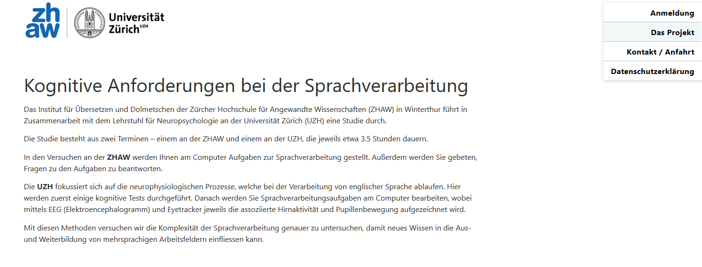

.footnote[https://psy-klipsy-web01.uzh.ch/anmeldung-clint-u/about-clint-u/]
---
# ZHAW Website
  
```{r fig.width=12, fig.height=6.5,echo=FALSE}
library(png)
library(grid)
img <- readPNG(file.path("figures/doko_presentation/zhaw_project.png"))
grid.raster(img)
```

.footnote[https://www.zhaw.ch/de/linguistik/institute-zentren/iued/forschung/clint/]
---
# Research Question
  
- English as Lingua Franca (ELF)

???
Communication between two non-native speakers in English
Example: to keep the ball flat vs. to keep our feet on the ground
--
  
- Increasingly more text and speeches in non-native English

--
  
-  Challenging for translators

???
ELF is more time and work demanding
--
  
- Enhanced cognitive load while translating
---
  
# Research Question
  
Mixed method approach that addresses:
  
--
  
- Problems reading and translating ELF text

--
  
- Language proficiency depending differences while reading and translating ELF text

--
  
- Cognitive load while reading and translating ELF text

--

<t>using:</t>

--
  
- EEG

- Eyetracking

- Inputs from Translating and ELF science
---
class: inverse, mline, center, middle

# Experiment with Translators

---
# Participants
  
L1: German

L2: English (Level C1)
--
  
.pull-left[
#### Translators (measured / recruited)
    
- 30 Professionals (5 / 12) 
    
- 30 Masters (7 / 6)
    
- 30 Bachelors (0 / 0)]
--
.pull-right[
#### Multilinguals (measured / recruited)
    
- 30 Professionals (5 / 1) 
    
- 30 Masters (1 / 1)
    
- 30 Bachelors (1 / 6)]
---
# Methods
  
.left-column[
## EEG]

.right-column[
  EGI 128-channel Geodesic Sensor Net<sup>1</sup>

  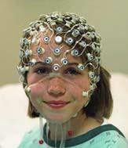]

.footnote[
  1) https://blricrex.hypotheses.org/files/2015/05/geodesic-sensor-net.pdf]

---
# Methods
.left-column[
## EEG
## Eyetracking]

.right-column[
  EyeLink 1000 Plus, SR Research<sup>2</sup>
  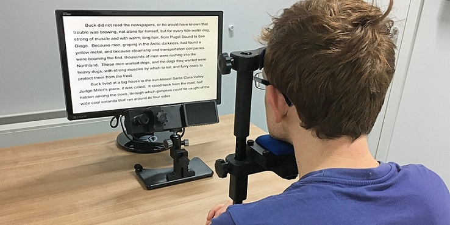
  ]

.footnote[
  1) https://blricrex.hypotheses.org/files/2015/05/geodesic-sensor-net.pdf  
2) https://twitter.com/SRResearchLtd/status/993860152867590144/photo/1]

???
  infrared video-based eye tracker
---
# Methods
.left-column[
## EEG
    
## Eyetracking
    
## Psychometrics]

.right-column[
* HAWIK-IV (short form)

* TMT

* N-Back (visual/auditory)
]

---
# Methods
.left-column[
## EEG
    
## Eyetracking

## Psychometrics
    
## LDT
] 
.right-column[
Visual Lexical Decision Task

* German

* English

* Switch
  ]

---
# Paradigm
```{r dpi = 1600, fig.width=8, fig.height=4,echo=FALSE}
library(png)
library(grid)
img <- readPNG(file.path("figures/doko_presentation/paradigm.png"))
grid.raster(img)
```

---
# Reading Task
  
Social Information and Energy Conservation - Environmental Identity and Social Norms  
ELF - Version

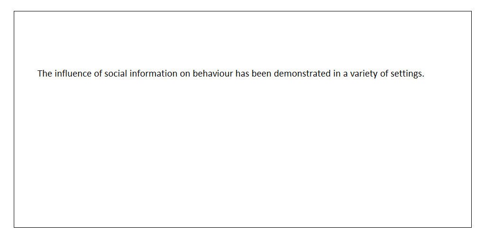

???
Sentence by sentence
Double spacing

---
# Reading Task
  
Social Information and Energy Conservation - Environmental Identity and Social Norms  
ELF - Version

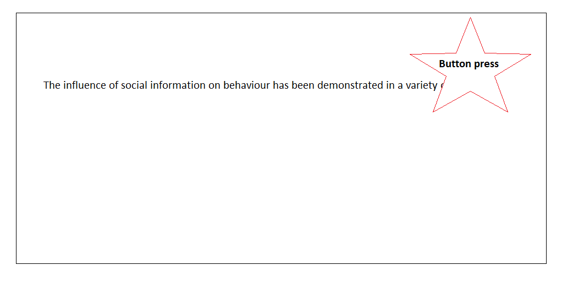

---
# Reading Task
  
Social Information and Energy Conservation - Environmental Identity and Social Norms  
ELF - Version

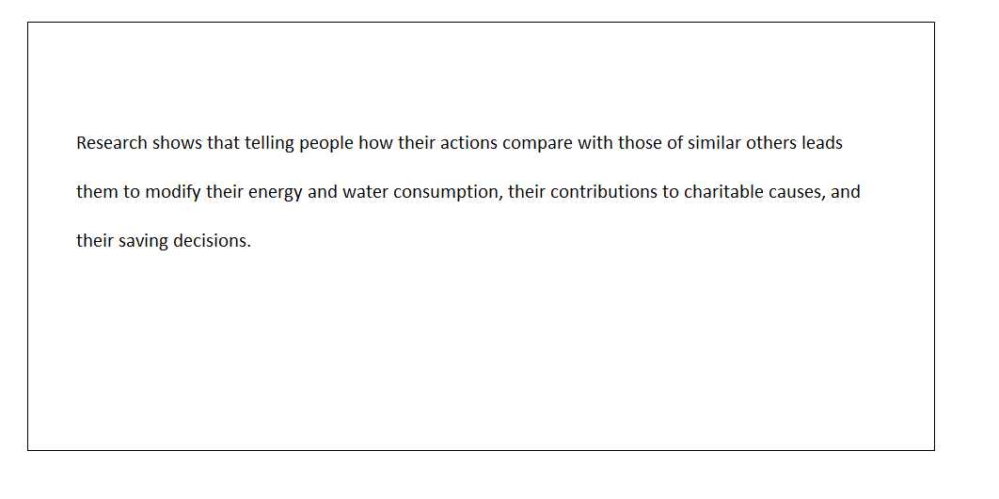

---
# Reading Task
  
Social Information and Energy Conservation - Environmental Identity and Social Norms  
EdE - Version


---
# Reading Task
  
Social Information and Energy Conservation - Environmental Identity and Social Norms  
EdE - Version

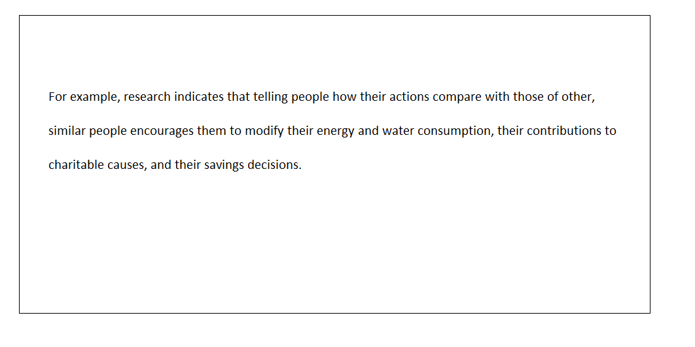

---
# Perceived Difficulty
  
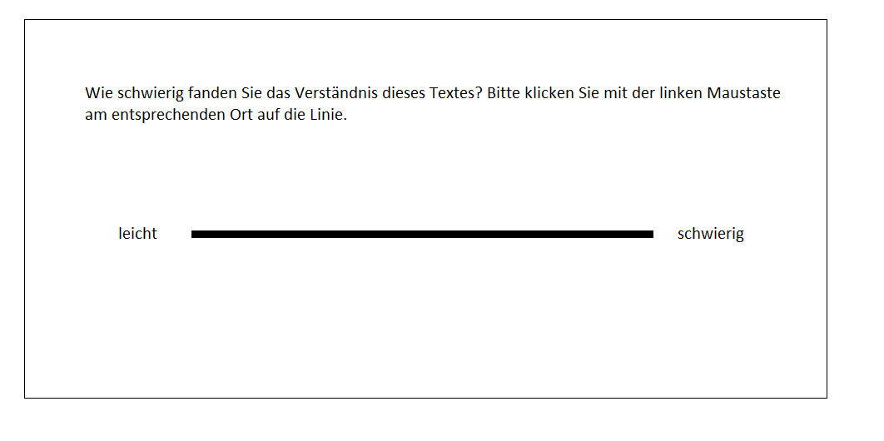


---
# Control Questions
  
Welches ist kein Element vom Home Electricity Report (HER)?
  
1) Vergleich von Energieverbrauchlevel

2) Rückmeldung zur individuellen Performanz

3) Tipps, wie man mehr Energie verbrauchen kann

---
# Copying Task
  
Social Information and Energy Conservation - Environmental Identity and Social Norms  
EdE - Version


---
# Translating Task
  
Social Information and Energy Conservation - Environmental Identity and Social Norms  
EdE - Version

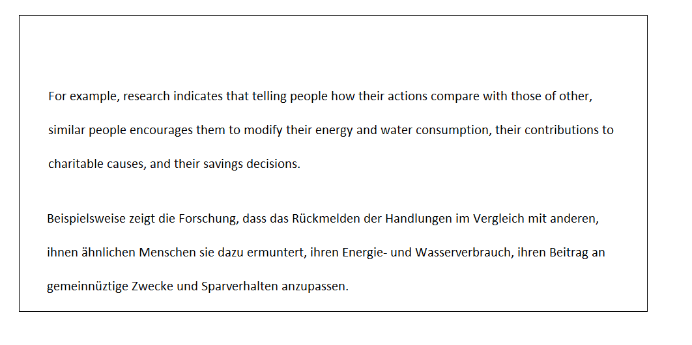

??? 
Shortcommings: keyboard is limited

---
# Translating Task
  
memoQ


---
class: inverse, mline, center, middle

# Operationalization

---

# Operationalization
.left-column[
## English-Test
  
Language Survey
  
HAWIK-IV
  
TMT
  
N-Back
  
Reading Duration
  
Control Questions
  
Perceived Difficulty
  
Translating Task
  
Copying Task
    ]
.right-column[
```{r error=FALSE, warning=FALSE, comment="" }
source(file.path("R/Preprocessing/psychometrics.R"))
glimpse(vpdata)
```
]
---
# Operationalization
.left-column[
## English-Test
  
Language Survey
  
HAWIK-IV
  
TMT
  
N-Back
  
Reading Duration
  
Control Questions
  
Perceived Difficulty
  
Translating Task
  
Copying Task
    ]
.right-column[
```{r plotSpT, fig.height=5, fig.width=10, message=FALSE, tidy = TRUE}
SpT <- vpdata %>% 
  filter(SpT_Score != 0) %>%
  group_by(group) %>% 
  summarise(SpT_means = mean(SpT_Score))

plot(with(SpT,SpT_means,group), main = "Language proficiency", xlab = "Group", ylab = "Score", type = "h")
remove(SpT)
```
]
---
# Operationalization
.left-column[
## English-Test
  
Language Survey
  
HAWIK-IV
  
TMT
  
N-Back
  
Control Questions
  
Perceived Difficulty

Reading Task
  
Copying Task

Translating Task
    ]
.right-column[
```{r finalplotSpT, dpi=600, fig.height= 4, warning= FALSE, message=FALSE}
source(file.path("R/Plots/PlotLanguageProficiency.R"))
```
]
---
# Operationalization
.left-column[
English-Test

## Limesurvey

HAWIK-IV

TMT
  
N-Back
  
Control Questions
  
Perceived Difficulty
  
Reading Task
  
Copying Task

Translating Task
]

.right-column[
  
- Age of commencement

- Exposure to language

- Experience (cumulative training hours)
]

---
# Language Survey
```{r error=FALSE, warning=FALSE, message=FALSE, comment = ""}
load(file.path("data/hgf.Rdata"))
load(file.path("data/hgf_doubles.Rdata"))

hgf <- hgf %>% 
  filter(group != "IntPro", group != "IntMA", group != "IntBA") %>% 
  select(VPN_Code, group, Alter, cum_trainingh_DuU, Prozent_cumth_Life.x,hpd_DuU, hpd_ALLE, Prozent_ALLE_pd)

colnames(hgf) <- c("id", "group", "age", "cumTH_U", "percCumTH_U", "HpD_U", "HpD_L", "percHpD_L")

glimpse(hgf)
```

---
# Language Survey
  
```{r error=FALSE, warning=FALSE, message=FALSE, comment = "", results = "asis"} 

doubles_df <- doubles_df %>% 
  select(VPN_Code, cum_trainingh_DuU, Prozent_cumth_Life.x,hpd_DuU)

colnames(doubles_df) <- c("id", "cumTH_U", "percCumTH_U", "HpD_U")

print(xtable(doubles_df,caption = "Doubled Datasets"), type = "html", html.table.attributes = "border=0")

```

---
# Extraordinary long days
```{r error=FALSE, warning=FALSE, message=FALSE, comment = "", results = "asis", echo=FALSE} 

hgf_res <- hgf %>% 
  filter(percCumTH_U >= 100 | percHpD_L >= 0)

DT::datatable(
  hgf,
  fillContainer = FALSE, options = list(pageLength = 8), editable = TRUE
)

#print(xtable(hgf_res,caption = "Extraordinary long days"), type = "html", html.table.attributes = "border=0")

```

---
# Language Survey
```{r error=FALSE, warning=FALSE, message=FALSE, comment = "", results = "asis"} 

hgf_res <- hgf %>% 
  group_by(group) %>% 
  summarise(meanCumTH_DuD = mean(cumTH_U), meanHpD_L = mean(HpD_L))

print(xtable(hgf_res,caption = "TraMa live longer"), type = "html", html.table.attributes = "border=0")

```

---
# Language Survey
```{r error=FALSE, warning=FALSE, message=FALSE, comment = "", results = "asis"} 

hgf_res <- hgf %>% 
  filter(group == "TraMA")

print(xtable(hgf_res,caption = "Study Translating!"), type = "html", html.table.attributes = "border=0")

```

---
# Operationalization
.left-column[
English-Test

Limesurvey

## HAWIK-IV

TMT
  
N-Back
  
Control Questions
  
Perceived Difficulty
  
Reading Task

Copying Task

Translating Task
]

.right-column[
Short form with 4 subtests:
  
- Gemeinsamkeiten finden

- Zahlen nachsprechen (vorwärts und rückwärts)

- Mosaik-Test

- Zahlensymboltest

T-Values **correlating with full HAWIK-IV**<sup>1</sup>:

.footnote[
  1) Waldmann (2008)]
]

---
# HAWIK-IV
  
```{r error=FALSE, warning=FALSE, message=FALSE, comment = "", results = "asis"} 
hawik <- vpdata %>% 
  filter(!is.na(HAWIE_T_Value), id != "C24") %>% 
  group_by(group) %>%
  summarise(meanWIE = mean(HAWIE_T_Value), sdWIE = sd(HAWIE_T_Value))

print(xtable(hawik,caption = "HAWIK-IV"), type = "html", html.table.attributes = "border=0")
```

---
# Operationalization
.left-column[
English-Test

Limesurvey

HAWIK-IV

## TMT
  
N-Back
  
Control Questions
  
Perceived Difficulty

Reading Task
  
Copying Task

Translating Task
]

.right-column[
- Processing speed

- 2 Subtests

- Mean processing time and errors 
]
---
# Trail Making Test
  
```{r error=FALSE, warning=FALSE, message=FALSE, comment = "", results = "asis"} 

tmt <- vpdata %>% 
  filter(!is.na(t_TMT_A_in_s)) %>% 
  group_by(group) %>%
  summarise(meanTMT_A = mean(t_TMT_A_in_s), sdTMT_A = sd(t_TMT_A_in_s), meanF_A = mean(F_TMT_A), meanTMT_B = mean(t_TMT_B_in_s), sdTMT_B = sd(t_TMT_B_in_s),meanF_B = mean(F_TMT_B))

print(xtable(tmt,caption = "TMT"), type = "html", html.table.attributes = "border=0")
```

---
# Operationalization
.left-column[
English-Test

Limesurvey

HAWIK-IV

TMT
  
## N-Back
  
Control Questions
  
Perceived Difficulty

Reading Task
  
Copying Task

Translating Task
]

.right-column[

- 2 Subtests (visual / auditory)

- 3-back with letters

- Working memory

<t>looking at:</t>

- Response times (?)

- dPrimes<sup>1</sup>:

  - sensitivity and response bias 
  - d' = z(Hit) minus z(FA)
  
- *Criterion c*
.footnote[
  1) Macmillan & Creelman (1991)]
]


```{r warning= FALSE, message=FALSE, echo=FALSE}

#source(file.path("R/Preprocessing/nback.R"))
#source(file.path("R/nback_analysing.R"))
```
---

# Operationalization
.left-column[
English-Test

Limesurvey

HAWIK-IV

TMT
  
N-Back
  
## Control Questions
  
Perceived Difficulty
  
Reading Duration

Copying Task

Translating Task
]

.right-column[

**Correct answers**

Interesting factors could be:

- Group
  - Expertise (translators vs. multilinguals)
  - Experience (BA, MA, Pro)
- Text
- Condition
- Time
]
---

# Control Questions

```{r warning= FALSE, message=FALSE, echo=FALSE}

source(file.path("R/Preprocessing/behavioral_data.R"))

```

```{r dpi=600, fig.height= 3, warning= FALSE, message=FALSE}
source(file.path("R/Plots/PlotContQuest.R"))
```

---

# Operationalization
.left-column[
English-Test

Limesurvey

HAWIK-IV

TMT
  
N-Back
  
Control Questions
  
## Perceived Difficulty
  
Reading Duration

Copying Task

Translating Task
]

.right-column[

**Perceived difficulty**

interesting factors could be:

- group
- task (reading vs. translating)
- text
- condition
- time
- timeTra
]

---
# Operationalization
.left-column[
English-Test

Limesurvey

HAWIK-IV

TMT
  
N-Back
  
Control Questions
  
Perceived Difficulty
  
## Reading Task

Copying Task

Translating Task
]

.right-column[

- Average reading duration per sentence

- Eyetracking data: 

  - average fixation duration
  - first-pass fixation time
  - regression time
  - number of fixations
  - number of regressions
  - saccade duration

--> depending on text difficulty, reading ability, motivation and strategy<sup>1</sup>

.footnote[
  1) Essig-Shih, L. Y. (2008)]
]

---
# Reading Task
  
```{r error=FALSE, warning=FALSE, message=FALSE, comment = "", results = "asis"} 

rd <- readingDuration %>% 
  group_by(group, text, condition) %>%
  summarise(meanRDpS = mean(avgReadingDuration))

DT::datatable(rd,fillContainer = FALSE, options = list(pageLength = 6), editable = TRUE)
```

---

```{r echo = FALSE}
list_names = c("English-Test",
               "Limesurvey",
               "HAWIK-IV",
               "TMT",
               "N-Back",
               "Control Questions",
               "Perceived Difficulty",
               "Reading Task",
               "Copying Task",
               "Translating Task")
```
# Operationalization
.left-column[
`r list_names[1]`

`r list_names[2]`

`r list_names[3]`

`r list_names[4]`

`r list_names[5]`

`r list_names[6]`

`r list_names[7]`

`r list_names[8]`

##`r list_names[9]`

`r list_names[10]`
]

.right-column[

- Efficiency: 
  - Total amount of chars typed

- Deletions: 

  - Total amount of backslashes proportional to total amount of chars

- Stringdist: 

  - Optimal string aligment distance (restricted Damerau-Levenshtein distance)

]
---
# Copying Task
  
```{r error=FALSE, warning=FALSE, message=FALSE, comment = "", results = "asis"} 
source(file.path("R/Preprocessing/copyingtask.R"))

group_data <- vpdata %>% 
  filter(id != c("C10","CXY","C20")) %>% 
  select(id, group)

copy <- full_join(group_data, res_copy, by="id")

copy <- copy %>%
  filter(id != c("C00")) %>% 
  pivot_longer(cols = c("T1_SE_copy","T1_ELF_copy", "T2_SE_copy", "T2_ELF_copy"), 
               names_to = "task", values_to = "stringDist")

stringDist <- copy %>%
  filter(!is.na(stringDist)) %>% 
  group_by(group, task) %>%
  summarise(meanStringDist = mean(stringDist))

```
---
# Copying Task
  
```{r error=FALSE, warning=FALSE, message=FALSE, comment = "", results = "asis"} 
DT::datatable(stringDist,fillContainer = FALSE, options = list(pageLength = 8), editable = TRUE)
```

---
# Operationalization
.left-column[
`r list_names[1]`

`r list_names[2]`

`r list_names[3]`

`r list_names[4]`

`r list_names[5]`

`r list_names[6]`

`r list_names[7]`

`r list_names[8]`

`r list_names[9]`

## Translating
]

.right-column[
- Efficiency: 

 - Total amount of chars typed

- Deletions: 

  - Total amount of backslashes proportional to total amount of chars

Rating of:

- Fluency

- Accuracy

compared to reference translation
]


---
# EEG
.pull-left[
### Workload

1) **Gevins (1997):**  

- Frontal midline theta:  
 Magnitude increases with workload

- Parietocentral alpha:  
Magnitude decreases with workload  

2) Frontal theta as indication<sup>1</sup>

3) **Holm et al. (2009):** Fz-theta / Pz-alpha - Ratio<sup>2</sup>

.footnote[
  1) Cavanagh & Frank (2014), Doppelmayr, Finkenzeller & Sauseng (2008),  
  Ishii et al. (1999), Kubota et al. (2001), Luu, Tucker & Makeig (2004),  
  Rutishauser et. al. (2010), Sammer et al. (2007)
  ]
]
--
.pull-right[
### Fixation related potentials (FRP)
- Event related potentials
- Starting and ending with fixations
- Challenges: 
  - Coregistrate EEG and Eyetracking<sup>3</sup>
  - Eye movement artifacts
  - Differential overlap
  - Parafovea-on-fovea effects
  - Where is ELF in the text?
  
.footnote[
  3)Dimigen et al. (2011)]
 
]
???
Word your interested in would be Baseline-Corrected with P300 of previous word
---
class: inverse, mline, center, middle

# Tools I've used so far

---
# Matlab
.left-column[
## Psychtoolbox
]
.right-column[
- Interface between computer hardware, EEG software,  Eyelink and Matlab

- Open source

- Set of functions for vision and neuroscience research

- Easier than low-level programming languages (e.g. C, Pascal)

- Accurate controlled visual and auditory stimuli

- Interaction with participant

]
.footnote[https://psychtoolbox.org  
https://github.com/Psychtoolbox-3/Psychtoolbox-3]
---
# Matlab
.left-column[
## Automagic
]
.right-column[
- Standardized preprocessing of big EEG Data

- Open source

- eeglab plugin

- Build by the group of Nicolas Langer

]
.footnote[https://github.com/methlabUZH/automagic]  

---
# Matlab
.left-column[
## EEGLAB
]
.right-column[
- Toolbox for processing continuous and event-related EEG

- Open source

- Swartz Center for Computational Neuroscience
]
.footnote[https://sccn.ucsd.edu/eeglab/index.php]  

---
# RStudio

- Open Source

--

- Fast growing community

--

- Reproducible research

--

- Structuring projects
  - https://www.geo.uzh.ch/microsite/reproducible_research/post/rr-r-publication/

--

- Version controlling of source code via git

--

- https://rstudio.com/resources/cheatsheets/

---
# RMarkdown

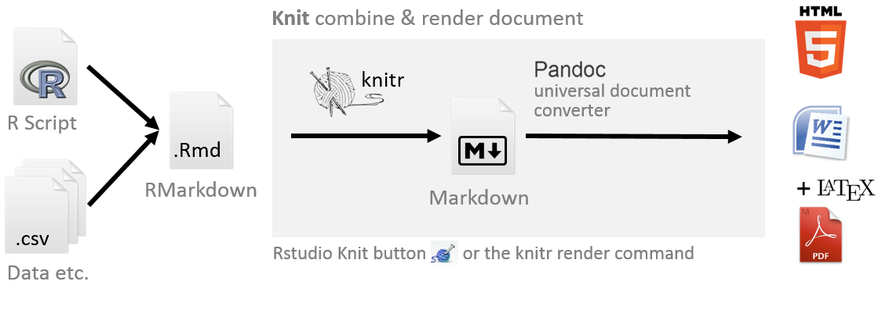

---
# RMarkdown
.pull-left[
- Knitr
 - Rscript
 - Markdown
 - .bib
 - html
 - tikz
 - JavaScript / CSS / remark
 - Python
 - C++
 - C / Fortran

- Output formats:
  - html / websites
  - LaTeX
  - pdf
  - word
  - powerpoint
]
.pull-right[

- HTML widgets and Shiny documents

- Journal articles 
  - papaja (Preparing APA Journal Articles)
  - rticles package
  - future: R Markdown submission

- Books
- Data presentation using Xaringan ;-)
.footnote[
https://bookdown.org/yihui/rmarkdown/basics.html
]
]
  
---

# GitHub

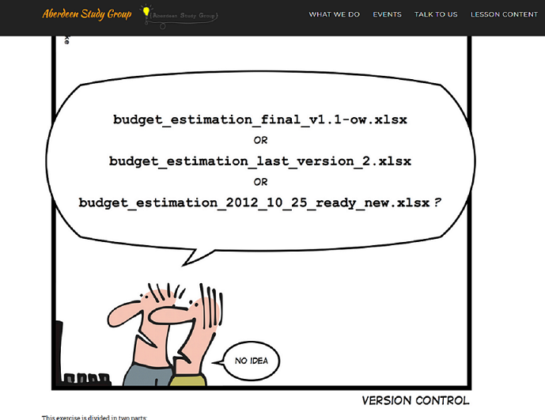

--- 
# GitHub

* https://aberdeenstudygroup.github.io/studyGroup/lessons/SG-T1-GitHubVersionControl/VersionControl/

* Synchronise GitHub repositories with RStudio projects

* Version controlling and collaborations

* Worldwide access to your files
  
* Synchronise with Overleaf

* Easy way to make your scripts and data analysis public

---

class: inverse, mline, center, middle

# Thanks for listening
